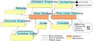
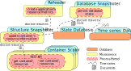
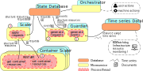

## High-level diagram 

This framework has been designed using a microservice approach in order
to ease its development as well as to create specialized units that can 
be reused or improved in isolation. In addition, by using this paradigm 
it is also possible to implement a framework that inherently presents an 
internal parallelism that is useful when dealing with scenarios that 
require responsiveness, such as is the case with real-time and on-demand 
resource scaling.

The next image shows a high-level diagram of the scenario on which the 
framework is deployed:

* [1] Beginning with the framework's **inputs**, there are two: 
1) the actions, that control the framework's behavior, both performed 
by an user or by another metadataprogram through the API; and, 
2) the resource monitoring time series, currently provided by an 
external framework ([BDWatchdog](http://bdwatchdog.dec.udc.es/monitoring/index.html)), 
that are used in the policy decision for the resource scaling operations.

* [2] Continuing with the actual **_Serverlesss Containers framework_**, which 
groups several microservices, some of which are placed on the controlled 
hosts. The microservices inner workings are further specified on the 
following sections.

* [3] And finishing with the **controlled infrastructure**, which usually 
consists of several hosts running each one or several containers. 
Currently only the containers backed by the cgroups file system are 
supported by design and, more specifically, Linux Containers (LXC) have 
been used and thus have been proven to work with this framewok. 

## Microservice architecture

As previously stated, the design followed to create the architecture of 
this framework uses several microservices that communicate and exchange 
information. The following image shows a high-level diagram of the 
microservices layout:

As it can be seen, the microservices can be separated into active and 
passive ones, with the difference being that the passive ones focus on 
feedback operations to keep the framework continuously updates on the
infrastructure's state, and the active ones that use such information to
change the state (the container's resource limits) accordingly as needed. 

### Passive Microservices

The passive microservices are needed to continuously keep the central 
database (State Database) updated with all the metadata that tracks the 
state of the infrastructure, from the number of containers and its 
thresholds to the allocated amounts of resources. 

Some passive microservices are used to create aggregated data for 
entities such as applications (i.e., representing a group of containers)
or to persist temporary information into a persistent database.

* **Structure Snapshoter**: Continuously polls the actually applied 
limits of the containers and writes that information into the State 
Database.
* **Database Snapshoter**: Forwards the information temporarily stored 
on the State Database to a persistent database, thus creating time series. 
* **Refeeder Snapshoter**: Aggregates and creates new metadata from 
existing one (e.g., allocated amount of CPU for an application composed 
of 3 containers)

### Active Microservices

The active microservices are the actual ones that perform the scaling
of the resources via changing the container resource limits on the 
underlying cgroups file system through a coordinated chain of events.

As described on the [Scaling policy](/use_case/#scaling-policy) 
subsection of the [Use Case](/use_case) section, in order to perform a 
scaling operation, the resource usage has to exceed the upper, or drop 
below the lower limit (1). After a configured time amount has passed on 
this state, the **Guardian** microservice will create a scaling request 
(2) with the specific amount of resource to be changed. Such request 
will be picked up and processed by the **Scaler** (3) and applied 
accordingly (4).

More specific functionalities of the microservices are described next:

* **Guardian**: Working with time windows, it matches the real resource 
usages of the containers, as provided with the external 
resource monitoring, with the container limits stored on the 
State Database. As a result of the matches it generates scaling requests. 
* **Scaler**: Polls the State Database looking for requests to be 
applied to the containers.

## Other/Common Microservices and Databases

Some microservices have an auxiliar role and are used both by active and 
passive microservices.

*  **Orchestrator**: Exposes an API that can be used both by humans or 
scripts to configure the framework.
* **Container Scaler**: This microservice has to be deployed on every 
infrastructure node whose hosted containers are to be scaled. This 
service is able to read and write the crgoups file system to perform 
the actual resource limit scaling operations.
