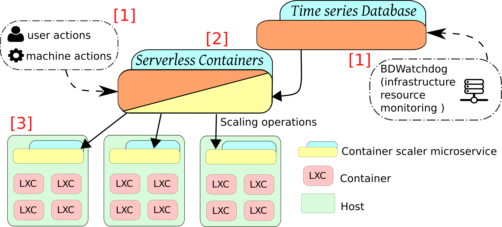
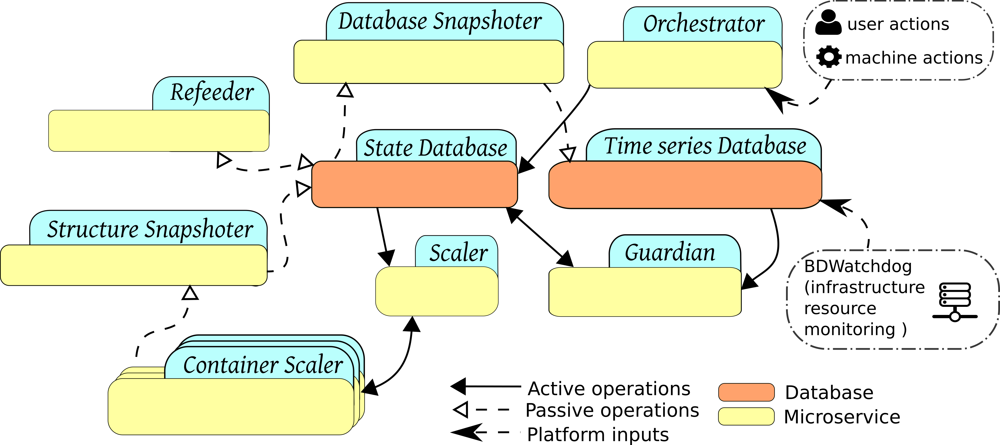

# Architecture

## High-level diagram 

This framework has been designed using a microservice approach in order
to ease its development as well as to create speciliazed units that can 
be reused or improved in isolation. In addition, by using this paradigm 
it is also possible to implement framework that inherently presents an 
internal parallelism that is useful when dealing with scenarios that 
require responsiveness, such as is the case with real-time and on-demand 
resource scaling.

The next image shows a high-level diagram of the scenario on which the 
framework is deployed:

* Beginning with the framework's **inputs** [1], there are two: 1) the 
actions, both performed by an user or by another program through the API, 
that control the framework's behavior; and, 2) the resource monitoring 
time series, currently provided by an external framework 
([BDWatchdog](https://bdwatchdog.readthedocs.io/en/latest/)), 
that are used in the policy decision for the resource scaling 
operations.

* Continuing with this **serverlesss containers framework** [2], which 
groups several microservices, some of which are placed on the controlled 
hosts. The framework's inner workings are further specified on the 
following sections.

* And finishing with the **controlled infrastructure** [3], which usually 
consists of several hosts running each one several instances of containers. 
Currently only the containers backed by the cgroups file system are 
supported by design and, more specifically, Linux Containers (LXC) have 
been used and thus tested to work with this framewok. 

## Design

As previously stated, the design followed to create the architecture of 
this framework uses several microservices that communicate and exchange 
information. The following image shows a high-level diagram of the 
microservices layout:

## Resource scaling policy

## Implementation (microservices)
