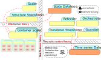

The **_Serverless Container framework_** can be deployed by cloning its 
[GitHub repo](https://github.com/UDC-GAC/ServerlessContainers) 
and placing and starting the proper services on the right environments.

To clone the project, you can use:
```
git clone https://github.com/UDC-GAC/ServerlessContainers
```

The actual deployment can be divided into different phases, as next 
described:

## Containers

**_Serverless Containers_** supports any container engine and 
container technology that is backed by the cgroup file system. 
Specifically, for development the 
[LXD container manager](https://linuxcontainers.org/lxd/introduction/), 
which deploys [Linux Containers (LXC)](https://linuxcontainers.org/), 
has been used.

There is no need for any specific configuration regarding the container 
deployment, nor there is a need to restart any container to begin 
adjusting its resources automatically. Nevertheless, in order to 
successfully perform such resource scaling operations, it may be needed 
to have permissions to write on the affected container's cgroups files.
To do this, the *Container Scaler* service has to be started with such
permissions.


## Previous Requirements

In order to work, **_Serverless Containers_** needs to have a constant 
feed of the resources the containers are using, as close to real-time 
as possible in order to maintain the responsiveness of the scaling. This 
feature is currently provided by the 
[**BDWatchdog**](http://bdwatchdog.dec.udc.es/monitoring/index.html) 
framework, which is mainly composed of a time series database, 
[**OpenTSBD**](http://opentsdb.net/) 
and of a resource monitor agent (atop) coupled with a processing pipeline 
which are able to work inside containers.

In addition, this framework has also at its core a JSON document database 
used as a cache of the system's state, referred to as *State Database*. 
Currently, a [**CouchDB**](https://couchdb.apache.org/) database is used. 
The installation of a functional CoudhDB database is quite simple and 
there is no need for any specific configuration to be used by this 
frameworks. Nonetheless, because the need for a high response of the 
database operations, the fact that the stored data does not need to be 
persisted across time and that the required storage size is relatively 
small (no more than 1 GiB for 30+ containers), it may be desirable to 
use in-memory storage 

Finally, other equirements include the Python3 runtime environment and 
other Python packages such as Flask.

## Microservices

All of the microservices deployed by **_Serverless Containers_** have 
been implemented as Python3 programs and thus, can be started by simply 
launching them with the system's interpreter. In addition, most of them 
also interact with the *State Database* so it is advisable that their 
latency with the latter is small. Other latencies that may be interesting
to take into account, as well as a proposed placement, are shown in the 
next image.



Finally, it should also be considered that some of these microservices, 
due to their inner operations and continuous polling, can show an overhead 
that although should not be particularly high, it could be noticeable
particularly in experimentation testbeds. Because of this, it is advisable
to run as many microservices as possible in an dedicated/isolated instance
separated from any environment not to be disturbed. 

### Passive

services: **Structure Snapshoter, Database Snapshoter, 
Refeeder Snapshoter**

Regarding the passive microservices, the *Structure Snapshoter* in 
particular has to poll the containers via the *Container Scaler* service, 
which is deployed in all the infrastructure nodes that host containers. 
Because of this the latency of this microservice should also be small 
when interacting with the nodes.
 

### Active

services: **Guardian, Scaler**

As with the *Structure Snapshoter* passive microservice, the *Scaler* 
also need to interact with the infrastructure nodes and their 
*Container Scaler* service, so the latency between the two should 
be kept low.


### Other

services: **Orchestrator, Container Scaler**

When it comes to the remaining microservices, the Orchestrator should be
placed near the *State Database*, as it may require to perform many 
database operations in a short amount of time, while the 
*Container Scaler* is **required** to be deployed on each infrastructure 
node that hosts containers.
